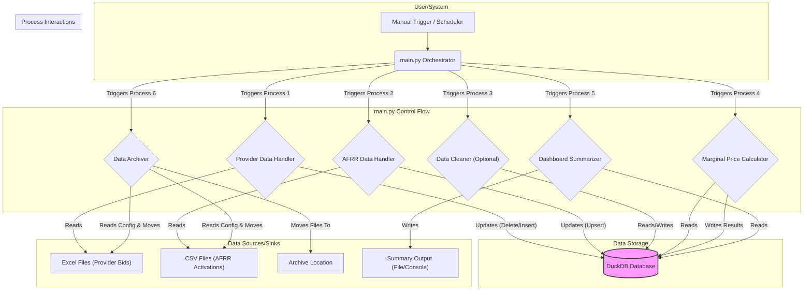

# Architecture Review Plan: HyperMVP

plan design for the codebase as of 13.04.2025

**1. Goal:**

* Review the current HyperMVP application structure and code.
* Identify areas for improvement focusing on **correctness, basic robustness, and maintainability** suitable for an MVP.
* Ensure the core data processing logic (provider bids, AFRR activations, marginal price calculation) is sound and matches requirements.
* Create a high-level visual representation of the application's components and interactions.
* Prioritize tasks to deliver a working MVP capable of analyzing the target data (e.g., Sept/Oct 2024).

**2. Current State Summary:**

* Python application using Poetry for dependency management.
* Core workflow orchestrated by `main.py`, calling other Python scripts via `subprocess`.
* Modules likely exist under `src/hypermvp/` for data loading (`provider/`, `afrr/`), cleaning, updating, archiving, and analysis.
* DuckDB (`hypermvp.duckdb`) is used for data storage and querying.
* Data sources: Excel (provider bids), CSV (AFRR activations).
* **Note:** A refactoring effort is underway for the provider data workflow to address previous issues (incomplete data loading from multi-sheet Excels, slow performance). This involves adding performance measurement and **currently focuses on loading data directly from Excel into DuckDB (skipping Pandas for the initial load)**, with subsequent cleaning/normalization potentially happening in DuckDB.
* Key logic:
  * Provider data: Delete-then-insert per 4h block based on file date range (See [`req_provider_flow.md`](/home/philly/hypermvp/src/hypermvp/provider/req_provider_flow.md)).
  * AFRR data: Upsert (update or insert) per 15min interval.
  * Marginal price calculation based on merit order.

**3. Review Areas & Step-by-Step Actions:**

* **Step 1: Verify Data Handling Logic & Add Unit Tests**
  * **Action:** Review the Python code implementing the provider data update (likely in a `provider` module script) and AFRR data update (likely in an `afrr` module script) against the documented requirements ([`req_provider_flow.md`](/home/philly/hypermvp/src/hypermvp/provider/req_provider_flow.md), [`technical documentation.md`](/home/philly/hypermvp/documentation/technical%20documentation.md)).
  * **Action:** Write `pytest` unit tests for these specific database update functions. Use small, controlled sample data (e.g., mock DataFrames or simple lists) and assert the database state (rows added/deleted/updated) is exactly correct after the operations.
  * **MVP Focus:** **Correctness is paramount.** Ensure the database operations precisely match the requirements to avoid data corruption.

* **Step 2: Assess Error Handling & Logging**
  * **Action:** Examine how `main.py` handles potential errors *from* the `subprocess` calls (e.g., script not found, script crashes with an error, database connection issue). Check if errors are caught and reported clearly.
  * **Action:** Implement basic logging using Python's standard `logging` module. Add logs in `main.py` for starting/ending each subprocess step and any errors caught. Add basic logs within the subprocess scripts for key actions (e.g., "Processing file X", "Updating DB for date Y").
  * **MVP Focus:** Prevent silent failures. Make it easy to see *what* the application is doing and *where* it failed if something goes wrong.

* **Step 3: Analyze Modularity & Refine Visual Overview**
  * **Action:** Evaluate the use of `subprocess`. *For the MVP*, if the `subprocess` calls are working and Step 2 (Error Handling) makes them robust, **sticking with `subprocess` is acceptable** to save time. Refactoring into direct function imports can be done later if needed.
  * **Action:** Update the visual diagram (below) to clearly show the orchestration flow.
  * **MVP Focus:** Ensure the current structure is understandable via the diagram. Defer major refactoring unless it blocks MVP goals.

* **Step 4: Check Scalability Bottlenecks (Data Loading)**
  * **Action:** Test loading the largest expected Excel/CSV files (e.g., a full month's data). Monitor memory usage (`top` or `htop` in terminal) and time taken.
  * **Action:** **Only if** performance is problematic *for the MVP's target data volume* (e.g., processing Sept/Oct 2024 takes hours or crashes due to memory): Investigate alternatives like `polars.scan_excel`/`scan_csv` or DuckDB's direct Excel/CSV querying (`read_csv_auto`, `read_excel`). Explain the tradeoffs (e.g., Polars might be faster but adds a dependency, DuckDB direct query might be simpler).
  * **MVP Focus:** Optimize only if necessary to achieve the MVP analysis goals. Avoid premature optimization.

* **Step 5: Review Test Coverage for Core Calculations**
  * **Action:** Identify the core function(s) responsible for the marginal price calculation (likely in an `analysis` or `calculator` module script).
  * **Action:** Write `pytest` unit tests for this calculation logic. Cover different scenarios: normal cases, cases with no bids, cases with tied bids, cases with missing activation data for an interval.
  * **MVP Focus:** Ensure the central analysis logic (the "brains" of the operation) is verified and produces correct results.

**4. Visual Overview (Conceptual Component Diagram):**

* **Explanation:**
  * `main.py` acts as the central orchestrator, triggering separate processes (likely via `subprocess`).
  * Each process performs a distinct task (loading, calculating, archiving).
  * Most processes interact with the central `DuckDB` database for reading and writing data.
  * Data flows from source files (Excel, CSV) into DuckDB, gets processed/analyzed, and source files are archived. Results are stored or outputted.

**5. Prioritization:**

* **Highest:** Step 1 (Data Handling Correctness & Tests), Step 2 (Error Handling & Logging). *Focus: Make it work correctly and reliably.*
* **Medium:** Step 5 (Calculation Tests), Step 3 (Modularity Review & Visual Overview). *Focus: Verify core logic and understand the structure.*
* **Lower (Address if Blocking MVP):** Step 4 (Scalability/Performance). *Focus: Optimize only if performance prevents achieving the MVP goal.*

This revised plan provides a clear roadmap. We should start with **Step 1: Verifying Data Handling Logic & Add Unit Tests**. Shall we identify the specific Python files and functions responsible for the provider and AFRR data updates in the database?
